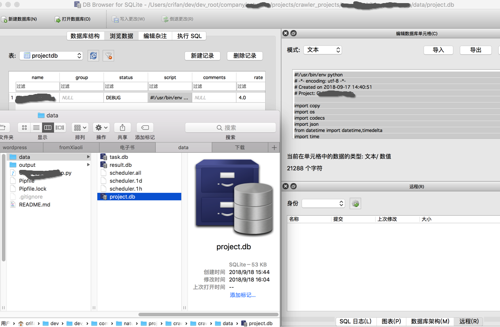
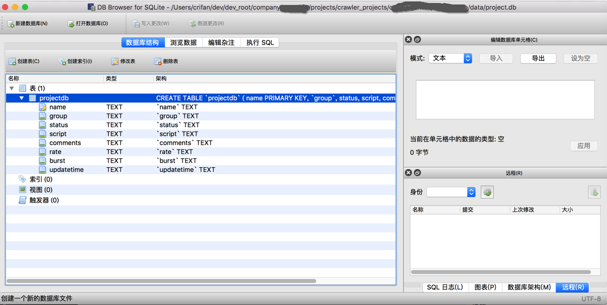
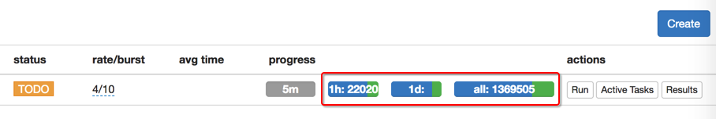
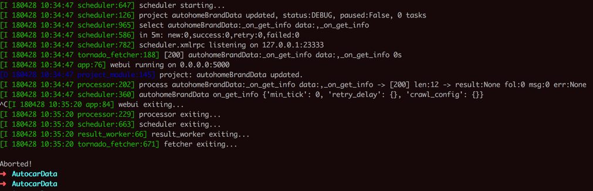
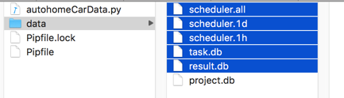

# PySpider所在目录下的`data`目录

在你运行`pyspider`后，自动会在命令执行路径下生成`data`文件夹，其中包含几个（SQLite）文件：

* `project.db`：保存了用户的爬虫项目相关信息，包括项目的`Python代码`
  * 比如用（SQlite）工具去查看，可以看到详细数据
  * 比如Mac中的`DB Browser for SQLite`查看的效果：
  * `Python代码`：
  * 
  * 对应数据库结构字段：
  * 
* `result.db`：项目运行的结果数据
* `task.db`：项目相关的任务信息
  * 其中如果开始运行爬虫，还会出现相关的调度信息：
  * `scheduler.all`, `scheduler.1d`, `scheduler.1h`：保存了任务执行后`所有`，`1天`，`1小时`内相关的信息，和WebUI中的`progress`中的`all`, `1d`, `1h`对应：
  * 

## 如何清除之前的或正在运行的任务

对于一个写好的爬虫，且已经点击`Run`运行，或者运行了一段时间后，主动停止了。

接着想要去删除之前下载的数据，则：

[官网的解释](http://docs.pyspider.org/en/latest/About-Projects/#about-projects)是：

设置`group`为`delete`，以及`status`为`STOP`后，过了(默认)`24小时`后，会自动删除该项目所有信息。

但是往往没法满足我们需求：

我不想要等待，只想现在就去：删除掉所有的信息，包括之前已经爬取的数据，之前的调度的任务等等数据。

经过一番研究后，发现了解决方案：

* 先去停止项目
  * WebUI中设置`status`为`STOP`
  * 终端中用`Control+C`强制停止`pyspider`的运行
    * 
* 再去删除文件：`result.db`和`task.db`
  * 如果还有任务相关的 `scheduler.all`，`scheduler.1d`，`scheduler.1h`，则一并删除
    * 

> #### danger:: 不要轻易在没备份代码情况下删除`project.db`
>
> 注意不要删除，保存了项目（配置和）代码的：`project.db`，否则代码就没了。（我最开始就这么干过，😂）

之后去重新运行pyspider，再去刷新WebUI界面：

http://0.0.0.0:5000/

即可看到干净的项目，没有了之前的任务和数据了。
