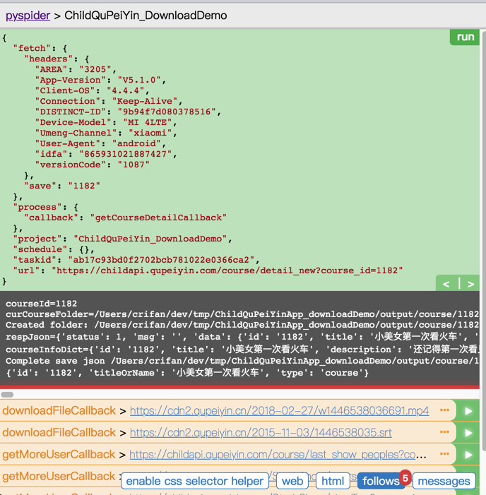

# 项目操作举例

此处就以一个简单的项目为例来说明，从头到尾是如何运行和操作的：

首次运行`pyspider`，会提示是否运行使用网络，点击`允许`


输出：

```bash
➜  ChildQuPeiYinApp_downloadDemo pyspider
phantomjs fetcher running on port 25555
[I 180925 11:25:51 result_worker:49] result_worker starting...
[I 180925 11:25:51 processor:211] processor starting...
[I 180925 11:25:51 tornado_fetcher:638] fetcher starting...
[I 180925 11:25:52 scheduler:647] scheduler starting...
[I 180925 11:25:52 scheduler:782] scheduler.xmlrpc listening on 127.0.0.1:23333
[I 180925 11:25:52 scheduler:586] in 5m: new:0,success:0,retry:0,failed:0
[I 180925 11:25:52 app:76] webui running on 0.0.0.0:5000
```

打开页面：

http://0.0.0.0:5000


去`Create New Project`新建项目


进入项目调试界面：


编写代码，或者已写好代码后去粘贴代码，再点击保存：


接着点击`Run`，开始运行。

会出现`Follow`，点击`Follow`


其中Follow后的`3`，指的是有产生了3条请求链接，可供后续继续访问


点击第一个的`三个点`，去展开：


可以看到当前请求的详细参数

点击`右箭头`=`>`


可以看到输出

然后再点击后续的链接，去运行：


点击 `左箭头`=`<` 返回上一级：


再点击`Run`


回到**上一级**的输出了：



如此，即可，根据需要去，反复的：

* 点击某个请求的`Run`，进入下一级
* 点击`<`返回上一级

去调试，直到得到你需要的结果，即可完成。
