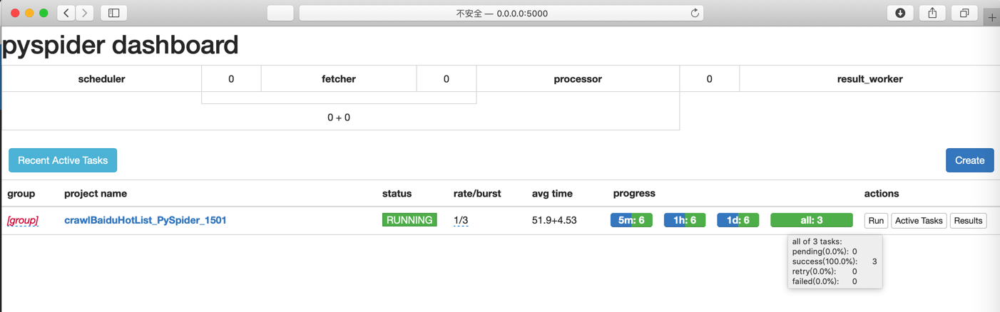
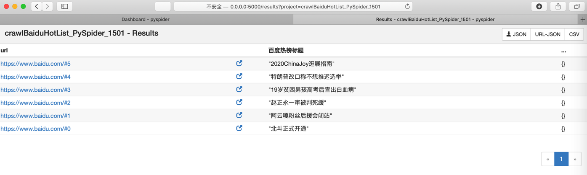
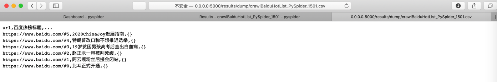
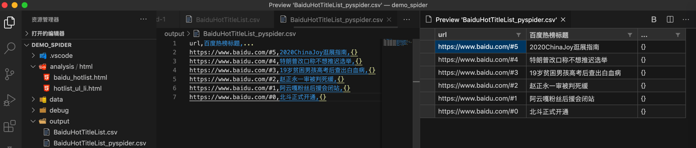

# 百度热榜

此处以 爬取百度热榜的内容列表 为例，去演示如何使用`PySpider`

## 代码`crawlBaiduHotList_PySpider_1501`

```python
#!/usr/bin/env python
# -*- encoding: utf-8 -*-
# Created on 2020-07-31 15:01:00
# Project: crawlBaiduHotList_PySpider_1501


from pyspider.libs.base_handler import *
from pyspider.database import connect_database  


class Handler(BaseHandler):
    crawl_config = {
    }


    # @every(minutes=24 * 60)
    def on_start(self):
        UserAgent_Chrome_Mac = "Mozilla/5.0 (Macintosh; Intel Mac OS X 10_14_6) AppleWebKit/537.36 (KHTML, like Gecko) Chrome/84.0.4147.89 Safari/537.36"
        curHeaderDict = {
            "User-Agent": UserAgent_Chrome_Mac,
        }
        self.crawl('https://www.baidu.com/', callback=self.baiduHome, headers=curHeaderDict)

    # @config(age=10 * 24 * 60 * 60)
    def baiduHome(self, response):
        # for eachItem in response.doc('span[class="title-content-title"]').items():


        titleItemGenerator = response.doc('span[class="title-content-title"]').items()
        titleItemList = list(titleItemGenerator)
        print("titleItemList=%s" % titleItemList)
        # for eachItem in titleItemList:
        for curIdx, eachItem in enumerate(titleItemList):
            print("[%d] eachItem=%s" % (curIdx, eachItem))
            itemTitleStr = eachItem.text()
            print("itemTitleStr=%s" % itemTitleStr)
            curUrl = "%s#%d" % (response.url, curIdx)
            print("curUrl=%s" % curUrl)
            curResult = {
                # "url": response.url,
                # "url": curUrl,
                "百度热榜标题": itemTitleStr,
            }
            # return curResult
            # self.send_message(self.project_name, curResult, url=response.url)
            self.send_message(self.project_name, curResult, url=curUrl)


    def on_message(self, project, msg):
        print("on_message: msg=", msg)
        return msg
```

## 效果和结果

* 调试
  * 
* 运行
  * 
* 点击`Results` -> Results结果
  * 
* 点击`CSV`-> 导出CSV
  * 
    * CSV预览
      * 

## 更多细节

详见：

【已解决】用Python爬虫框架PySpider实现爬虫爬取百度热榜内容列表
