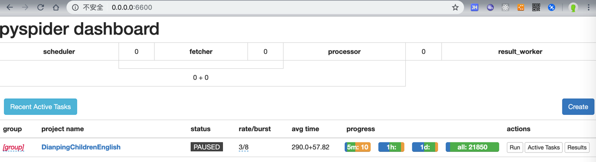
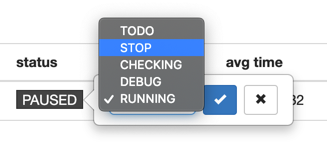
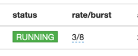
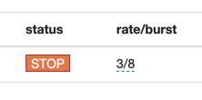
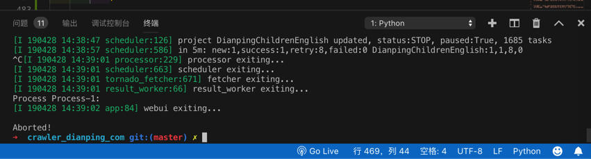
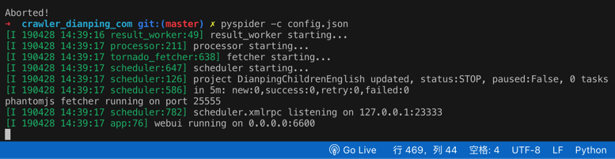
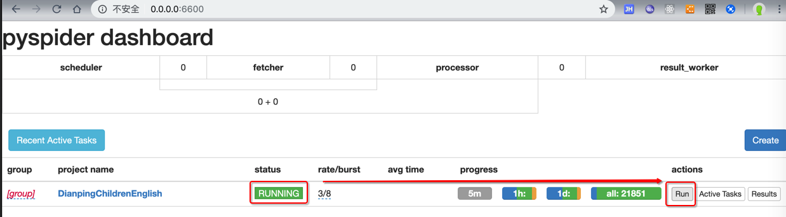
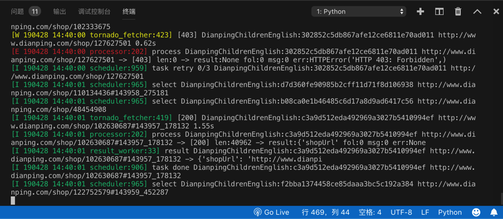
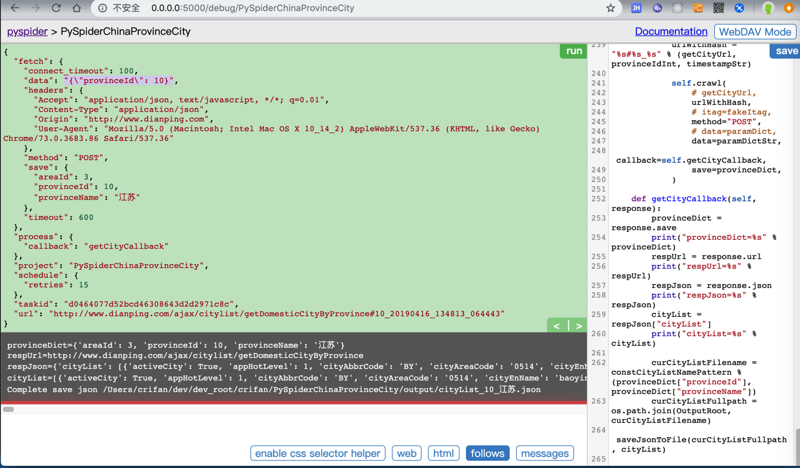

# PySpider常见的坑

关于折腾PySpider期间，遇到很多或大或小的坑，常见和具体细节相关的坑，已记录到对应部分中了。

此处再继续整理出，其他的一些常见的坑。

## `HTTP 599 Operation timed out after milliseconds with out of bytes received`

类似现象：

```bash
after 120001 milliseconds with 0 bytes receive
after 120000 milliseconds with 1723300 out of 2343850 bytes received 120.00s
```

解释：

-> 意思是：超时了（超过设置的最大超时时间了），但是只下载了总共数据的其中一部分

-> 重点是后半句，意思是可以下载到数据的，只是直到超时都还没下载完全

-> 这种情况的最大可能原因就是：网速太慢

-》所以

### 解决办法

#### 根本办法：换个更快的网络

比如，我公司是`1MB/s`的网络，家里是`10MB/s`的网络，换到家里下载，就不会出现这个问题了

#### 临时的规避的缓解的办法：增大延迟`timeout` （ +增大其他容错参数`connect_timeout`, `retries`）

* 给单个`self.crawl`增大参数
    ```python
    self.crawl(urlToDownload,
        callback=self.downloadFileCallback,
        connect_timeout=100,
        timeout=600,
        retries=15,
        save=fileInfo)
    ```
* 或：增大全局参数
    ```python
    class Handler(BaseHandler):
        crawl_config = {
            "connect_timeout": 100,
            "timeout": 600,
            "retries": 15,
        }
    ```

参数含义解释详见官网：

* [self.crawl - pyspider](http://docs.pyspider.org/en/latest/apis/self.crawl/)

## css的选择器不工作

**背景**：网页中的源码本来是：

```html
<a href="//car.autohome.com.cn/pic/series/3170.html#pvareaid=103448">
```

或者类似的：

```html
href="/pic/series-t/3170.html"
```


然后去写css选择器：

```python
a[href^="//car.autohome.com.cn/pic/series/"]
```

但是却无法匹配

**原因**：`PySpider`内部的css选择器用的是`PyQuery`，其默认把href的路径，加上了对应的host，所以此时获取到的html实际上变成了：

```html
<a href="https://car.autohome.com.cn/pic/series/3170.html#pvareaid=103448">
```

详见：

[response.doc](http://docs.pyspider.org/en/latest/apis/Response/#responsedoc)

> Reponse.doc() 返回的就是一个PyQuery的对象
> **Links have made as absolute by default**

**猜测**：估计是为了方便小白用户，所以默认加上了host，但是坑了其他人啊。

**解决办法**：此处被逼的css选择器写法只能改为：

```python
a[href*="pic/series/"]
```

或类似的代码：

```python
fnRightPicSeries = response.doc('.search-pic-tbar .fn-right a[href*="/pic/series"]')
fullPicSeriesUrl = fnRightPicSeries.attr.href
```

已经得到的是，加了host/domain的绝对路径了：

```python
fullPicSeriesUrl= https://car.autohome.com.cn/pic/series-t/3170.html
```


详见：
[【已解决】pyspider中的css选择器不工作 – 在路上](https://www.crifan.com/pyspider_css_selector_not_working/)

## Error Could not create web server listening on port 25555

**原因**：对应的25555端口被占用了

**根本原因**：之前的PySpider没有正常的彻底的被关闭，所以残留了。

**解决办法**：彻底`kill`干掉之前的PySpider的进程即可。

**举例**：

普通Linux类系统，用：

* 找到占了25555端口的进程的id：`ps aux | grep 25555`
* 再去杀掉进程：`kill process_id -9`

即可。

如果是Mac中，则用`lsof`

```bash
➜  AutocarData lsof -i:25555
COMMAND     PID   USER   FD   TYPE             DEVICE SIZE/OFF NODE NAME
phantomjs 46971 crifan   12u  IPv4 0xe4d24cdcaf5e481f      0t0  TCP *:25555 (LISTEN)
➜  AutocarData kill  46971
```

## `PAUSED`后无法立刻继续运行

当PySpider在爬取期间发现太多的url都是`retry`重试，则会变成`PAUSED`



猜测：其内部有比较智能的判断，推测是断网或者网络异常了，所以暂停下载

通过直接把`PAUSED`改为`STOP`



或改为了`RUNNING`



但是刷新一下页面，就还是显示PAUSED

-> 不能立刻开始继续下载

-> 往往要等很长时间之后才能继续下载

而如果自己想要立刻继续下载，经过研究，可以：

* 先改为STOP
  * 
* 停止PySpider
  * Control+C停止
    * 
* 重新运行PySpider
  * 
* 再改为RUNNING，点击Run
  * 

即可立刻继续运行了



## post时data传递dict有时候不行

比如

[crifan/PySpiderChinaProvinceCity](https://github.com/crifan/PySpiderChinaProvinceCity)

```python
getCityUrl = "http://www.dianping.com/ajax/citylist/getDomesticCityByProvince"
for eachProvince in provinceList:
    print("eachProvince=%s" % eachProvince)
    provinceIdInt = eachProvince["provinceId"]
    paramDict = {
        "provinceId": provinceIdInt,
    }
    paramDictStr = json.dumps(paramDict)
...
    self.crawl(
        # getCityUrl,
        urlWithHash,
        # itag=fakeItag,
        method="POST",
        # data=paramDict,
        data=paramDictStr,
        callback=self.getCityCallback,
        save=provinceDict,
    )
```

`data`要传递`json`变量`paramDict`去`json.dumps`后的字符串`paramDictStr`才可以：



如果换成`dict`：

```python
getCityUrl = "http://www.dianping.com/ajax/citylist/getDomesticCityByProvince"
for eachProvince in provinceList:
    print("eachProvince=%s" % eachProvince)
    provinceIdInt = eachProvince["provinceId"]
    paramDict = {
        "provinceId": provinceIdInt,
    }
    paramDictStr = json.dumps(paramDict)
...
    self.crawl(
        # getCityUrl,
        urlWithHash,
        # itag=fakeItag,
        method="POST",
        data=paramDict,
        # data=paramDictStr,
        callback=self.getCityCallback,
        save=provinceDict,
    )
```

且已经指定了全局配置`crawl_config`中的`headers`的`Content-Type`是`application/json`

-> 以为`PySpider`的`self.crawl`会自动把`dict`类型的`data`去`json dump`成字符串，结果却是：

只保留了`key`和`value`：

```python
"data": "provinceId=10",
```

导致报错：

```bash
    requests.exceptions.HTTPError: HTTP 400: Bad Request
```

![pyspider_http_400_bad_request]

之前还遇到过一个类似的例子：

```python
SelfReadingUrl = "http://www.xxxxxxxxx.cn:83/Reading.svc/selfReadingBookQuery2"

    def on_start(self):
        jValueTemplateSelfReading = "{\"userId\":\"%s\",\"fieldName\":\"\",\"fieldValue\":\"全部类别\",\"grades\":\"\",\"levels\":\"\",\"supportingResources\":\"有音频\",\"offset\":%d,\"limit\":%d}"

        paramDictSelfReading = {
            "curUrl": SelfReadingUrl,
            "offset": 0,
            "limit": DefaultPageSize,
            "jValueTemplate": jValueTemplateSelfReading
        }
        self.getBookQuery2(paramDictSelfReading)


    def getBookQuery2(self, curParamDict):
...
        jValueStr = jValueTemplate % (gUserId, offset, limit)
        jcJsonDict = {
            "J": jValueStr,
            "C": 0
        }
        jcJsonDictStr = json.dumps(jcJsonDict)
        ......
        self.crawl(curUrlWithHash,
            itag=fakeItagForceRecrawl, # To force re-crawl for next page
            method="POST",
            # data=jcJsonDict,
            data= jcJsonDictStr,
            # callback=curCallback,
            callback=self.getBookQuery2Callback,
            headers=curHeaders,
            save=curParamDict
        )
```

其中也是：

给`data`参数用了`json`去`dump`后的字符串变量：`jcJsonDictStr`

而不是`json`的`dict`变量：`jcJsonDict`

才最终正确获取到数据的。
