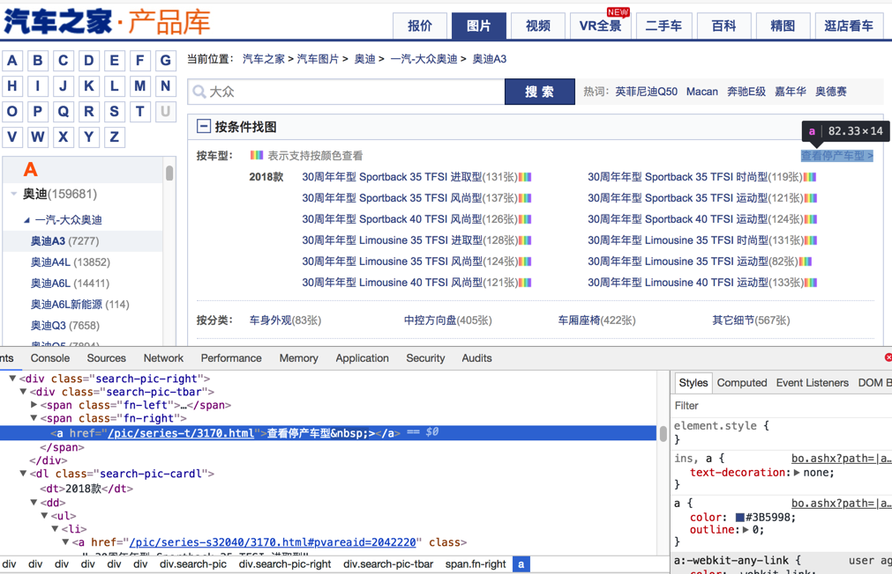

# PySpider常见的坑

关于折腾PySpider期间，遇到很多或大或小的坑，常见和具体细节相关的坑，已记录到对应部分中了。

此处再继续整理出，其他的一些常见的坑。

## css的选择器不工作

**背景**：网页中的源码本来是：

```html
<a href="//car.autohome.com.cn/pic/series/3170.html#pvareaid=103448">
```

或者类似的：

```html
href="/pic/series-t/3170.html"
```



然后去写css选择器：

```python
a[href^="//car.autohome.com.cn/pic/series/"]
```

但是却无法匹配

**原因**：`PySpider`内部的css选择器用的是`PyQuery`，其默认把href的路径，加上了对应的host，所以此时获取到的html实际上变成了：

```html
<a href="https://car.autohome.com.cn/pic/series/3170.html#pvareaid=103448">
```

详见：

[response.doc](http://docs.pyspider.org/en/latest/apis/Response/#responsedoc)

> Reponse.doc() 返回的就是一个PyQuery的对象
> **Links have made as absolute by default**

**猜测**：估计是为了方便小白用户，所以默认加上了host，但是坑了其他人啊。

**解决办法**：此处被逼的css选择器写法只能改为：

```python
a[href*="pic/series/"]
```

或类似的代码：

```python
fnRightPicSeries = response.doc('.search-pic-tbar .fn-right a[href*="/pic/series"]')
fullPicSeriesUrl = fnRightPicSeries.attr.href
```

已经得到的是，加了host/domain的绝对路径了：

```python
fullPicSeriesUrl= https://car.autohome.com.cn/pic/series-t/3170.html
```


详见：
[【已解决】pyspider中的css选择器不工作 – 在路上](https://www.crifan.com/pyspider_css_selector_not_working/)

## Error Could not create web server listening on port 25555

**原因**：对应的25555端口被占用了

**根本原因**：之前的PySpider没有正常的彻底的被关闭，所以残留了。

**解决办法**：彻底`kill`干掉之前的PySpider的进程即可。

**举例**：

普通Linux类系统，用：

* 找到占了25555端口的进程的id：`ps aux | grep 25555`
* 再去杀掉进程：`kill process_id -9`

即可。

如果是Mac中，则用`lsof`

```shell
➜  AutocarData lsof -i:25555
COMMAND     PID   USER   FD   TYPE             DEVICE SIZE/OFF NODE NAME
phantomjs 46971 crifan   12u  IPv4 0xe4d24cdcaf5e481f      0t0  TCP *:25555 (LISTEN)
➜  AutocarData kill  46971
```
