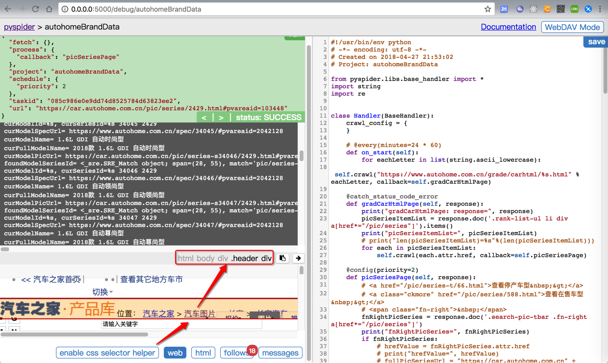

# PySpider的心得

## 对于加载更多内容，除了想办法找js或api，也可以换个其他的思路

**问题**：想要获取单个页面的更多的内容，一般页面都是向下滚动，加载更多。内部往往是js实现，调用额外的api获取更多数据，加载更多数据。

**思路**：所以一般往往会去研究和抓包，搞清楚调用的api。但是其实有思路多去看看网页中与之相关的其他内容，往往可以通过其他途径，比如另外有个单独的页面，可以获取我所需要的所有的车型车系的数据。就可以避免非要去研究和抓包api了。

详见：[【已解决】pyspider中如何加载汽车之家页面中的更多内容](http://www.crifan.com/pyspider_how_load_more_content_data_from_current_page)

## 调试界面中的`enable css selector helper`

点击web后可以看到html页面内容

再点击`enable css selector helper`后

之后点击某个页面元素，则可以直接显示出对应的css的selector



不过话说我个人调试页面期间，很少用到。

都是直接去Chrome浏览器中调试页面，查看html源码，寻找合适的css selector。

## 发送`POST`请求且传递格式为`application/x-www-form-urlencoded`的`form data`参数

代码：

```python
    @config(age=10 * 24 * 60 * 60)
    def index_page(self, response):
        # &lt;ul class="list-user list-user-1" id="list-user-1"&gt;
        for each in response.doc('ul[id^="list-user"] li  a[href^="http"]').items():
            self.crawl(each.attr.href, callback=self.detail_page)

        maxPageNum = 10
        for curPageIdx in range(maxPageNum):
            curPageNum = curPageIdx + 1
            print("curPageNum=%s" % curPageNum)
            getShowsUrl = "http://xxx/index.php?m=home&amp;c=match_new&amp;a=get_shows"
            headerDict = {
                "Content-Type": "application/x-www-form-urlencoded"
            }
            dataDict = {
                "counter": curPageNum,
                "order": 1,
                "match_type": 2,
                "match_name": "",
                "act_id": 3
            }
            self.crawl(
                getShowsUrl,
                method="POST",
                headers=headerDict,
                data=dataDict,
                cookies=response.cookies,
                callback=self.parseGetShowsCallback
            )

    def parseGetShowsCallback(self, response):
        print("parseGetShowsCallback: self=%s, response=%s"%(self, response))
        respJson = response.json
        print("respJson=%s" % (respJson))
```

实现了：

* 发送`POST`
  * 传递header
    * `"Content-Type": "application/x-www-form-urlencoded"`
  * 传递`data`
    * 一个`dict`，包含对应的`key`和`value`
  * 顺带传递了`cookie`
    * `cookies=response.cookies`
  * 获得返回的`JSON`
    * `callback`中用`response.json`

## 无法继续爬取时，注意是否是重复url导致的

当发现没有继续爬取后续数据时，记得想想是不是重复url导致的。

比如此处的：

```bash
POST /selfReadingBookQuery2
{ "offset": 0, "limit":10}
```

和：

```bash
POST /selfReadingBookQuery2
{ "offset": 10, "limit":10}
```

虽然（json参数）变化了，但是url没变

-> 导致不（重复）爬取

解决办法：让每次的url不同

实现方式：比如给url后面加上`#hash`值

### 举例说明

```python
timestampStr = datetime.now().strftime("%Y%m%d_%H%M%S_%f")
curUrlWithHash = curUrl + "#" + timestampStr

self.crawl(curUrlWithHash,
...
```

的：

```bash
/selfReadingBookQuery2#20190409_162018_413205

/selfReadingBookQuery2#20190409_162117_711811
```

即可实现，每次请求url都不同，就可以继续爬取了。

如果还是不行，或者说，为了更加保险，可以再去加上itag，比如：

```python
# add hash value for url to force re-crawl when POST url not changed
timestampStr = datetime.now().strftime("%Y%m%d_%H%M%S_%f")
curUrlWithHash = curUrl + "#" + timestampStr

fakeItagForceRecrawl = "%s_%s_%s" % (timestampStr, offset, limit)

self.crawl(curUrlWithHash,
    itag=fakeItagForceRecrawl, # To force re-crawl for next page
    method="POST",
```
