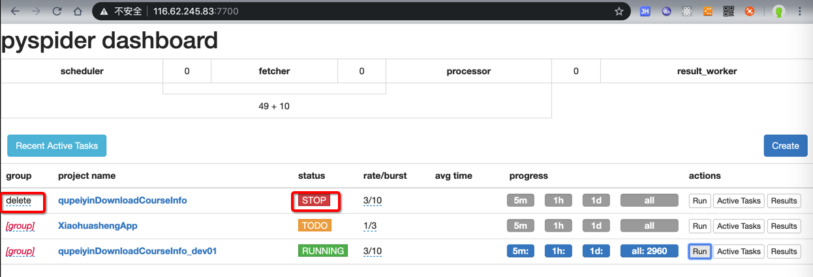
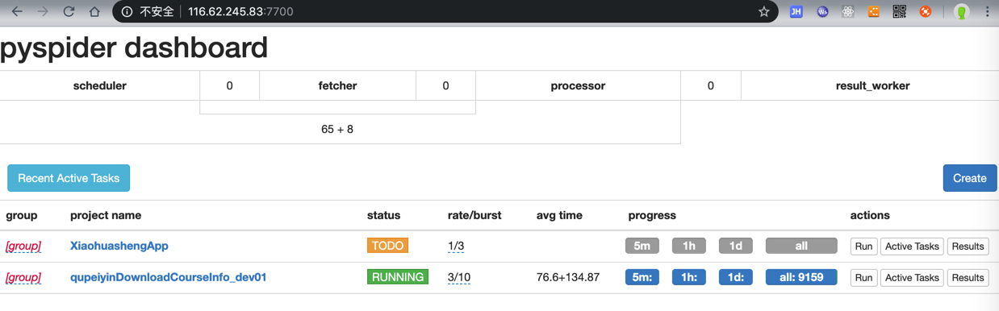

# 删除项目

## 如何清除之前的或正在运行的任务

对于一个写好的爬虫，且已经点击`Run`运行，或者运行了一段时间后，主动停止了。

接着想要去删除之前下载的数据，则：

[官网的解释](http://docs.pyspider.org/en/latest/About-Projects/#about-projects)是：

设置`group`为`delete`，以及`status`为`STOP`后，过了(默认)`24小时`后，会自动删除该项目所有信息。

但是往往没法满足我们需求：

我不想要等待，只想现在就去：删除掉所有的信息，包括之前已经爬取的数据，之前的调度的任务等等数据。

经过一番研究后，发现了解决方案：

* 先去停止项目
  * WebUI中设置`status`为`STOP`
  * 终端中用`Control+C`强制停止`pyspider`的运行
    * 
* 再去删除文件：`result.db`和`task.db`
  * 如果还有任务相关的 `scheduler.all`，`scheduler.1d`，`scheduler.1h`，则一并删除
    * 

> #### danger:: 不要轻易在没备份代码情况下删除`project.db`
>
> 注意不要删除，保存了项目（配置和）代码的：`project.db`，否则代码就没了。（我最开始就这么干过，😂）

之后去重新运行pyspider，再去刷新WebUI界面：

http://0.0.0.0:5000/

即可看到干净的项目，没有了之前的任务和数据了。

## 指定多久之后删除项目，即指定项目删除等待时间

PySpider中的项目，想要删除：

默认逻辑是，status设置为STOP（如果有group，那么group的status也要设置为delete），再等24小时后，才会自动删除

但是往往我们不想要等待那么久

想要指定删除的时间，则有2种方式去设置参数。

举例说明，比如想要`30秒`后删除，则可以：

* 文件：`config.json`：设置`scheduler`的`delete_time`参数
    ```json
    "scheduler": {
        "delete_time": 30
    }
    ```
* 命令行传入：`scheduler.DELETE_TIME`
    ```bash
    pyspider -c config.json scheduler --delete-time=30
    ```

然后`WebUI`中设置

* `status`是`STOP`
* `group`设置为`delete`



然后过了30秒后，去刷新，该项目就被删除了，看不到了：


