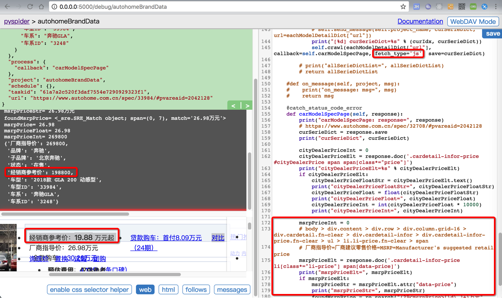
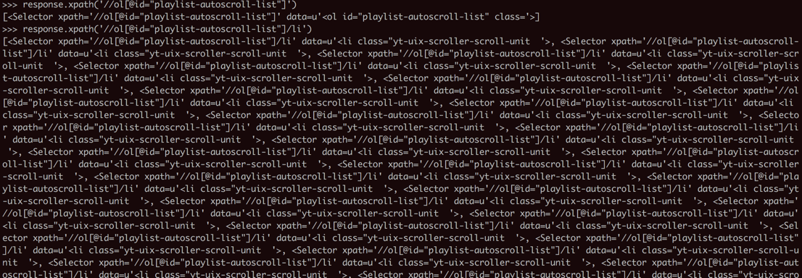

# PySpider简介

`PySpider`的基本信息：

* 是个Python的爬虫框架

* 最大特点：
    * 带图形界面WebUI的调试
    * 简单易用
    * 同时功能也很强大
* GitHub
    * https://github.com/binux/pyspider
* 文档：
    * 官方，英文：http://docs.pyspider.org/
    * 非官方，中文：http://www.pyspider.cn/index.html
* 作者
    * 网名：`Binux`
    * 别名：足叉兆虫
    * 博客：[Binuxの杂货铺](https://binux.blog)
    * Github: [binux (Roy Binux)](https://github.com/binux)

## `PySpider`对比`Scrapy`

对于两个流行的Python的爬虫框架，PySpider和Scrapy，常常会被人拿来对比。

对此，之前简单总结如下：

* PySpider：简单易上手，带图形界面（基于浏览器页面）
    * 一图胜千言：在WebUI中调试爬虫代码
    * 
* Scrapy：可以高级定制化实现更加复杂的控制
    * 一图胜千言：Scrapy一般是在命令行界面中调试页面返回数据：
    * 

详见： [【整理】pyspider vs scrapy](http://www.crifan.com/python_spider_framework_pyspider_vs_scrapy)